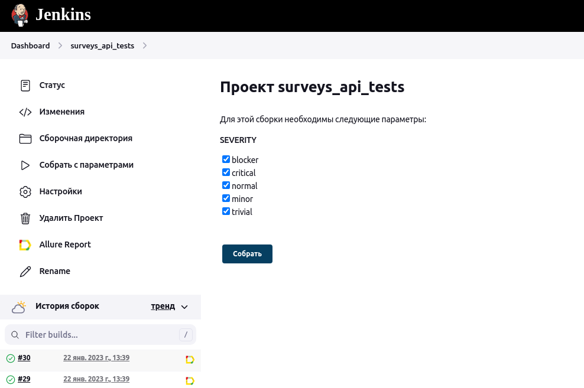

# Автоматизация тестирования API для сервиса [SurveysAPI](https://surveys-biof.onrender.com)

## Содержание

+ [Технологии и инструменты](#Технологии)
+ [Тест-кейсы](#Тесты)
+ [Запуск автотестов из Jenkins](#Jenkins)
+ [Оповещение о результатах через Telegram-бот](#Telegram)
+ [Отчеты о прохождении тестов Allure report](#Allure)

## Технологии и инструменты

## Тест-кейсы

###### Авторизация:

- Успешная авторизация
- Неуспешная авторизация. Не указан пароль

###### Действия с пользователем:

- Добавление пользователя
- Изменение данных пользователя
- Удаление пользователя

## Запуск автотестов из Jenkins

Для удаленного запуска автотестов в <a href="http://45.80.71.190:8080/" target="_blank">Jenkins</a> создана задача (job), настроена и связана с репозиторием в GitHub.

## Уведомление о результатах тестирования через Telegram-бот

После завершения тестов происходит отправка сообщения в Telegram с помощью заранее созданного Telegram-бота, подключенного в
задаче Jenkins.

## Отчеты тестов Allure report

После выполнения тестов формируются отчеты Allure, которые можно посмотреть со страницы задачи в Jenkins.

